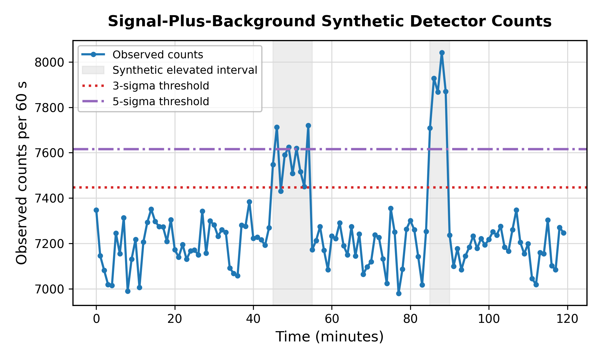
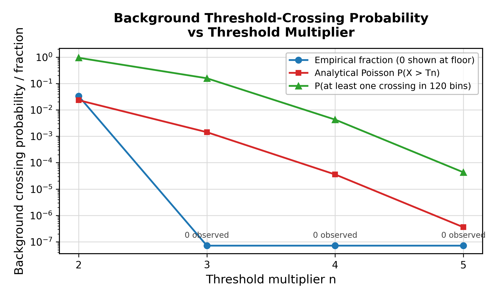

# Portable Radiation Detector Background and Threshold Simulation

A compact synthetic detector-counting project for Poisson background simulation, n-sigma threshold analysis, analytical false-positive estimates, Monte Carlo crossing summaries, and report-ready figures.

The project uses synthetic gross-count data for a single detector proxy. It is intended as a reproducible data-analysis and technical-reporting example, not an instrument certification package or dose-assessment tool.

## Key result

Increasing the threshold multiplier reduced background-only crossings, but also reduced the fraction of elevated-count bins that crossed threshold. In the fixed synthetic run, the 3-sigma threshold crossed during 14 of 15 elevated bins, while the 5-sigma threshold crossed during 9 of 15 elevated bins.

The main lesson is that a threshold crossing is a statistical review signal, not certainty. Threshold selection changes the balance between sensitivity, false-positive behavior, and delayed or missed elevated intervals.

## Figures

The signal-plus-background sequence shows two controlled elevated-count intervals compared with the 3-sigma and 5-sigma review thresholds.



The threshold-probability figure compares fixed-run empirical crossings, analytical Poisson exceedance probabilities, and the probability of at least one background crossing over the full 120-minute sequence.



## What this repository demonstrates

- Poisson simulation of detector background counts
- Controlled elevated-count intervals in a signal-plus-background sequence
- Background mean and variance estimation
- 2-sigma through 5-sigma threshold calculations
- Threshold-crossing tables
- Analytical Poisson exceedance probabilities
- Monte Carlo false-positive and event-crossing summaries
- Matplotlib and MATLAB figure generation
- A short LaTeX technical report with reproducible tables and figures
- Basic verification tests for generated outputs and threshold calculations

## Quick start

```bash
python -m venv .venv
source .venv/bin/activate
pip install -r requirements.txt
python src/simulate_counts.py
python src/threshold_analysis.py
python src/threshold_analysis.py --n-trials 10000
python -m unittest discover -s tests
```

On Windows PowerShell:

```powershell
python -m venv .venv
.\.venv\Scripts\python.exe -m pip install -r requirements.txt
.\.venv\Scripts\python.exe src\simulate_counts.py
.\.venv\Scripts\python.exe src\threshold_analysis.py
.\.venv\Scripts\python.exe src\threshold_analysis.py --n-trials 10000
.\.venv\Scripts\python.exe -m unittest discover -s tests
```

## Repository layout

```text
radiation-detector-threshold-simulation/
  README.md
  LICENSE
  Makefile
  requirements.txt
  data/
    synthetic_detector_config.csv
  src/
    simulate_counts.py
    threshold_analysis.py
  outputs/
    background_only_counts.csv
    signal_plus_background_counts.csv
    threshold_crossings.csv
    false_positive_summary.csv
    background_threshold_tail_summary.csv
    monte_carlo_false_positive_summary.csv
    monte_carlo_event_detection_summary.csv
    run_manifest.json
  figures/
    background_only_counts.png
    signal_plus_background_counts.png
    threshold_crossing_zoom.png
    false_positive_rate_vs_threshold.png
    background_only_counts_matlab.png
    signal_plus_background_counts_matlab.png
    threshold_crossing_zoom_matlab.png
    false_positive_rate_vs_threshold_matlab.png
  images/
    background_only_counts_matlab.png
    signal_plus_background_counts_matlab.png
    threshold_crossing_zoom_matlab.png
    false_positive_rate_vs_threshold_matlab.png
  matlab/
    plot_detector_threshold_figures.m
  report/
    detector_threshold_demo_report.tex
    detector_threshold_demo_report.pdf
  tests/
    test_simulation_outputs.py
    test_threshold_analysis.py
```

## MATLAB figure export

The Python scripts create the primary CSV outputs and Python figures. The MATLAB script recreates polished report figures from the CSV outputs and copies them into `images/` for LaTeX/Overleaf use.

From the repository root, run:

```bash
matlab -batch "cd('matlab'); plot_detector_threshold_figures"
```

## Technical report

The report source is in `report/detector_threshold_demo_report.tex`. To compile it locally:

```bash
cd report
pdflatex -interaction=nonstopmode detector_threshold_demo_report.tex
pdflatex -interaction=nonstopmode detector_threshold_demo_report.tex
```

The compiled PDF is included at `report/detector_threshold_demo_report.pdf`.

## Default synthetic case

- Detector used in the report: D001
- Background mean: 7200 counts/min
- Integration interval: 60 s
- Duration: 120 min
- Random seed for the fixed sequence: 42
- Elevated interval 1: minutes 45 to 55, added mean signal 350 counts/min
- Elevated interval 2: minutes 85 to 90, added mean signal 650 counts/min
- Threshold multipliers: 2, 3, 4, 5
- Monte Carlo repetitions in the report: 10,000

## Main outputs

The generated CSV outputs are written to `outputs/`. The most important files are:

- `background_only_counts.csv`
- `signal_plus_background_counts.csv`
- `threshold_crossings.csv`
- `false_positive_summary.csv`
- `background_threshold_tail_summary.csv`
- `monte_carlo_false_positive_summary.csv`
- `monte_carlo_event_detection_summary.csv`
- `run_manifest.json`

The generated figures are written to `figures/`. The four MATLAB-polished report figures are also copied to `images/` for direct LaTeX compilation.

## Verification

Run the test suite after regenerating outputs:

```bash
python -m unittest discover -s tests
```

The tests check row counts, event interval construction, threshold formulas, probability bounds, the default 3-sigma event crossing, and figure artifact creation.

## Limitations

The model assumes a stationary background and independent Poisson sampling over one-minute bins. It does not model spectroscopy, calibration drift, detector dead time, angular response, isotope identification, detector efficiency, environmental transport, dose conversion, or field deployment.

The results are suitable for demonstrating detector-counting data analysis, threshold behavior, Monte Carlo summaries, and measurement-quality interpretation under controlled synthetic assumptions.

## Last verification

The included outputs and report were regenerated on 2026-05-15 with Python 3.13.5. The final run regenerated the synthetic count files, threshold summaries, Monte Carlo summaries, figures, run manifest, test results, and compiled PDF report.
